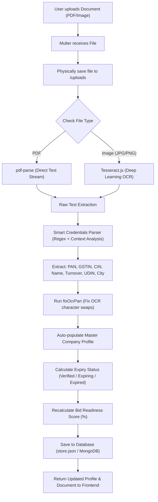

# 🏢 Company Vault - Technical & Feature Documentation

> **Tender Bid Automation Platform**  
> *Module: Company Vault & Statutory Credentials Management*

---

## 📌 1. Overview (Yeh Kya Hai?)
**Company Vault** ek centralized repository hai jahan company ke saare official, financial aur statutory documents (jaise PAN Card, GSTIN Certificate, CA Audited Turnover, Incorporation Certificate, MSME, ISO Certificates) securely store hote hain.

Jab bhi user koi document upload karta hai, to system **Automatic OCR & Parsing** ke zariye document me se key credentials extract karta hai aur **Master Company Profile** ko bina manual typing ke automatically sync/update kar deta hai.

---

## ⚡ 2. Core Features (Kya-Kya Features Hain?)

1. **Multi-Format Document Upload:**
   - Supports **PDFs** (`.pdf`) aur **Scanned Images** (`.jpg`, `.jpeg`, `.png`, `.webp`).
   - File size aur unique naming (`vault-<timestamp>-<filename>`) ke saath safe local physical storage (`/uploads`).

2. **Smart OCR & Multi-Engine Text Extraction:**
   - **Digital PDFs:** `pdf-parse` engine se 100% accurate direct text extraction.
   - **Scanned Images / Photos:** `Tesseract.js` (LSTM Deep Learning Neural Network) OCR engine se image pixels ko text me convert kiya jata hai.

3. **Intelligent Pattern Matching & OCR Typo Correction:**
   - **PAN Card Normalization (`normalizePAN` & `fixOcrPan`):** Indian PAN format (`5 Letters + 4 Digits + 1 Letter`) ke mutabiq OCR errors (jaise `O` <-> `0`, `I` <-> `1`, `S` <-> `5`, `B` <-> `8`, `Z` <-> `2`) ko automatically detect aur fix karta hai.
   - **GSTIN Detection:** 15-digit alphanumeric GST code extraction.
   - **CIN Number:** Corporate Identification Number extraction.
   - **Company / Firm Legal Name:** Assessee / Enterprise name extraction.
   - **Financial Turnover & Net Worth:** CA Audit / P&L balance sheets se multi-year annual turnover (in Lakhs / Crores) aur average turnover calculation.
   - **CA UDIN Number:** 18-digit unique Chartered Accountant UDIN code detection.
   - **Registered Location / Headquarters:** City/State address detection.

4. **Auto-Sync with Master Company Profile:**
   - Document upload hote hi master profile ke fields (`pan`, `gstin`, `cin`, `annualTurnover`, `averageTurnoverINR`, `headquarters`, `name`) automatically update ho jate hain.

5. **Expiry Tracking & Auto-Tagging:**
   - Document expiry date ke hisaab se status tag lagta hai:
     - 🟢 **Verified:** Valid document (Expiry > 60 days).
     - 🟡 **Expiring:** 60 dino ke andar expire hone wala document.
     - 🔴 **Expired:** Expired document.

6. **Bid Readiness Score Engine (`calculateReadinessScore`):**
   - Vault me uploaded documents ke verification status ke base par company ka real-time **Readiness Score (%)** calculate hota hai, jisse pata chalta hai ki company tender bidding ke liye kitni ready hai.

7. **Full CRUD Support:**
   - Documents ko View karna, Re-upload/Edit karna aur Delete karna supported hai (file physical storage se bhi safely delete ho jati hai).

---

## 🛠️ 3. Technologies & Libraries Used

| Technology / Library | Purpose |
| :--- | :--- |
| **Node.js & Express** | REST API endpoints and backend routing |
| **Multer** | Multipart form-data file upload & buffer management |
| **`pdf-parse`** | High-speed digital text extraction from PDF streams |
| **`tesseract.js`** | Offline Deep Learning OCR engine (LSTM neural network) |
| **Custom Regex & Fixers** | Deterministic credential normalization & error-fixing |
| **JSON Store / MongoDB** | Multi-layer persistent storage (`store.json` + Mongoose model) |
| **Lucide Icons** | Category-specific dynamic icons (`ShieldCheck`, `CircleDollarSign`, `FileText`, `FileCheck2`) |

---

## 🔄 4. Step-by-Step Architecture & Working Flow

---

## 📊 5. Accuracy Breakdown

| Document Source | Engine | Typical Accuracy | Notes |
| :--- | :--- | :---: | :--- |
| **Digital PDF (Computer Generated)** | `pdf-parse` + Regex | **95% – 99%** | Best format for ITR, GST, CA certificates |
| **Clean Flatbed Scanned Image** | Tesseract OCR + `fixOcrPan` | **80% – 90%** | Clear images give excellent extraction |
| **Mobile Photo / Angles / Shadow** | Tesseract OCR | **45% – 65%** | Lighting & glare affect OCR |
| **Handwritten Text** | Tesseract OCR | **15% – 30%** | Manual entry recommended |

---

## 🔌 6. API Endpoints Reference

### 1. Get Master Profile
* **Route:** `GET /api/company-profile`
* **Response:** `{ success: true, companyProfile: { ... } }`

### 2. Update Profile Fields
* **Route:** `PUT /api/company-profile`
* **Body:** `{ name, pan, gstin, annualTurnover, ... }`

### 3. Upload Vault Document
* **Route:** `POST /api/company-profile/documents`
* **Content-Type:** `multipart/form-data`
* **Body Params:** `document` (File), `name` (String), `category` (String), `expiryDate` (Date)
* **Response:** `{ success: true, document: { ... }, companyProfile: { ... } }`

### 4. Update Existing Document
* **Route:** `PUT /api/company-profile/documents/:docId`
* **Content-Type:** `multipart/form-data`

### 5. Delete Document
* **Route:** `DELETE /api/company-profile/documents/:docId`

---

## 📁 7. File Structure Reference
- **Service & Business Logic:** [`company-profile.service.js`](file:///d:/Vikas%20Data/bearly-ai/tender-bid-automation/server/modules/company-profile/company-profile.service.js)
- **Controller:** [`company-profile.controller.js`](file:///d:/Vikas%20Data/bearly-ai/tender-bid-automation/server/modules/company-profile/company-profile.controller.js)
- **Validation & Score Calculation:** [`company-profile.validation.js`](file:///d:/Vikas%20Data/bearly-ai/tender-bid-automation/server/modules/company-profile/company-profile.validation.js)
- **Repository / DB Layer:** [`company-profile.repository.js`](file:///d:/Vikas%20Data/bearly-ai/tender-bid-automation/server/modules/company-profile/company-profile.repository.js)
- **Routes:** [`company-profile.routes.js`](file:///d:/Vikas%20Data/bearly-ai/tender-bid-automation/server/modules/company-profile/company-profile.routes.js)
