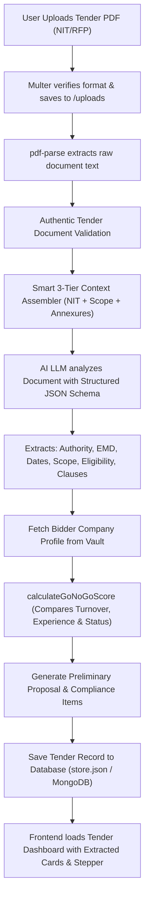

# 📑 Tender Intake & Smart RFP Extraction - Technical & Feature Documentation

> **Tender Bid Automation Platform**  
> *Module: Tender Intake, Smart Extraction & Automated Eligibility Analysis*

---

## 📌 1. Overview (Yeh Kya Hai?)
**Tender Intake** platform ka core entry point hai jahan user Government aur Enterprise Tenders ke **NIT (Notice Inviting Tender) / RFP (Request for Proposal) PDFs** upload karta hai.

Badi 80–100+ pages ki tender files me se manually dates, EMD, turnover requirement dhoondhna mushkil hota hai. Yeh module **AI (LLM) aur Smart Chunking Engine** ka use karke document me se saari critical details second me extract karta hai aur company ke **Vault** ke sath match karke **Instant Go/No-Go Decision** generate karta hai.

---

## ⚡ 2. Core Features (Kya-Kya Features Hain?)

1. **Large RFP PDF Ingestion (Up to 50MB / 100+ Pages):**
   - Multer streaming ke through heavy tender documents ko safely receive aur store karta hai.
   - Non-PDF files ko reject karke standard PDF format validate karta hai.

2. **Smart 3-Tier Context Chunking (`buildSmartDocumentContext`):**
   - LLM ke token context window ko optimize karne ke liye document ko 3 essential layers me intelligently filter karta hai:
     - **Layer 1 (Starting Pages ~20,000 chars):** NIT notice, schedule of dates, issuing authority, project title.
     - **Layer 2 (Middle Section Pattern Match):** Eligibility criteria, turnover rules, SLA/penalties, scope of work.
     - **Layer 3 (End Pages ~25,000 chars):** Required Annexures, affidavits, formats, declaration forms.

3. **Multimodal & Dual-Engine AI Extraction (`analyzeTenderWithAI`):**
   - **Primary Engine (Multimodal AI / LLM):** Google Gemini / Groq multimodal model raw PDF ya filtered context ko analyze karta hai.
   - **Fallback Engine (`documentParser.js`):** Agar AI API offline ya timeout ho, to robust regular expressions se Dates, EMD, Estimated Value aur Authority nikal li jaati hai.

4. **Extracted Tender Parameters (Kya-Kya Extract Hota Hai?):**
   - **Tender Identification:** Tender/NIT Number, Exact Project Work Title, Issuing Authority / Ministry / PSU.
   - **Financials:** Estimated Tender Value (INR + Display string), EMD Amount (INR + Display string), Tender Fee.
   - **Key Dates & Schedule:** Bid Submission Deadline, Pre-bid Meeting Date, Tender Publish Date.
   - **Scope of Work:** Authentic summary of deliverables and domain-specific terms of reference.
   - **Eligibility Criteria:** Minimum Annual Turnover required, Minimum Experience in years, Required Certifications (ISO 9001, 27001, CMMI etc.).
   - **Compliance Matrix Clauses:** Har distinct clause ko `clauseNo`, `requirement`, `evidenceDoc`, aur `status` ke sath extract karna.
   - **Detected Annexures:** Annexure-A, B, C, Non-Blacklisting declarations ki list.
   - **Risk Assessment:** Identified procurement risks and severity (Low / Medium / High).

5. **Live Company Vault Cross-Verification & Go/No-Go Engine:**
   - Document extract hote hi system **Company Vault** ke records (Turnover, Net Worth, Experience, Active Documents) ke sath compare karta hai:
     - ✅ **GO (Eligible / Recommended):** Agar company ke paas required turnover aur documents hain.
     - ⚠️ **CONDITIONAL GO:** Agar minor gaps hain jo joint venture / clarifications se solve ho sakte hain.
     - ❌ **NO-GO (Disqualified):** Agar turnover ya mandatory criteria meet nahi hota.

6. **Domain-Aware Proposal & BOQ Stubs:**
   - Tender ke domain (IT, Consultancy, Advisory, Civil, Manpower) ke mutabiq initial Executive Summary, Technical Approach, aur Implementation Roadmap automatically create ho jata hai.
   - Agar document me line-item BOQ present hai, to itemized BOQ auto-generate hota hai.

---

## 🛠️ 3. Technologies & Libraries Used

| Technology / Library | Purpose |
| :--- | :--- |
| **Node.js & Express** | REST API endpoints for upload and repository management |
| **Multer** | Multipart disk storage with 50MB file size limits and PDF filter |
| **`pdf-parse`** | High-throughput digital text extraction from tender PDFs |
| **Google Gemini / Groq LLMs** | Advanced semantic understanding, reasoning and JSON extraction |
| **Custom 3-Tier Regex Chunking** | Intelligent context assembly for 100+ page documents |
| **`uuid`** | Unique identifiers for tenders, compliance clauses, and BOQ items |
| **JSON Store / MongoDB** | Dual-mode persistence for tender repository |

---

## 🔄 4. Step-by-Step Working Flow



---

## 🔗 5. How Tender Intake Links with Company Vault

```
┌────────────────────────────────────────┐       ┌──────────────────────────────────────┐
│             COMPANY VAULT              │       │            TENDER INTAKE             │
│ • Average Turnover: ₹5.50 Cr           │       │ • Required Min Turnover: ₹3.00 Cr    │
│ • Statutory: Active PAN, GSTIN, CIN    │ ───►  │ • Required Docs: CA UDIN Certificate │
│ • Certifications: ISO 9001, ISO 27001  │       │ • Experience: 3 Years in IT Services │
│ • Readiness Score: 100%                │       │                                      │
└────────────────────────────────────────┘       └──────────────────┬───────────────────┘
                                                                    │
                                                       Automated Fit Analysis
                                                                    ▼
                                                 ┌──────────────────────────────────────┐
                                                 │       VERDICT: "GO (PASS)"           │
                                                 │ Score: 92/100 | Ready for Bidding    │
                                                 └──────────────────────────────────────┘
```

---

## 🔌 6. API Endpoints Reference

### 1. Upload & Analyze Tender PDF
* **Route:** `POST /api/tenders/upload`
* **Content-Type:** `multipart/form-data`
* **Body Params:** `document` (File)
* **Response:** `{ success: true, tender: { id, title, authority, estimatedValueINR, emdAmountINR, complianceItems, ... } }`

### 2. Get All Tenders Repository
* **Route:** `GET /api/tenders`
* **Response:** `{ success: true, count: 5, tenders: [ ... ] }`

### 3. Get Specific Tender by ID
* **Route:** `GET /api/tenders/:id`
* **Response:** `{ success: true, tender: { ... } }`

### 4. Create Tender Manually
* **Route:** `POST /api/tenders/manual`
* **Body:** `{ title, organization, estimatedValueINR, submissionDeadline, ... }`

### 5. Update Tender Details
* **Route:** `PUT /api/tenders/:id`
* **Body:** `{ title, status, ... }`

### 6. Delete Tender
* **Route:** `DELETE /api/tenders/:id`

---

## 📁 7. File Structure Reference
- **AI Service & Prompts:** [`aiService.js`](file:///d:/Vikas%20Data/bearly-ai/tender-bid-automation/server/services/aiService.js)
- **Document Text & Regex Parser:** [`documentParser.js`](file:///d:/Vikas%20Data/bearly-ai/tender-bid-automation/server/services/documentParser.js)
- **Tender Controller:** [`tenderController.js`](file:///d:/Vikas%20Data/bearly-ai/tender-bid-automation/server/controllers/tenderController.js)
- **Tender Routes:** [`tenderRoutes.js`](file:///d:/Vikas%20Data/bearly-ai/tender-bid-automation/server/routes/tenderRoutes.js)
- **Go/No-Go Scoring Engine:** [`goNoGoEngine.js`](file:///d:/Vikas%20Data/bearly-ai/tender-bid-automation/server/services/goNoGoEngine.js)
- **Compliance Generator:** [`complianceEngine.js`](file:///d:/Vikas%20Data/bearly-ai/tender-bid-automation/server/services/complianceEngine.js)
- **Frontend Hub Page:** [`TenderIntake.tsx`](file:///d:/Vikas%20Data/bearly-ai/tender-bid-automation/client/src/pages/TenderIntake.tsx)
